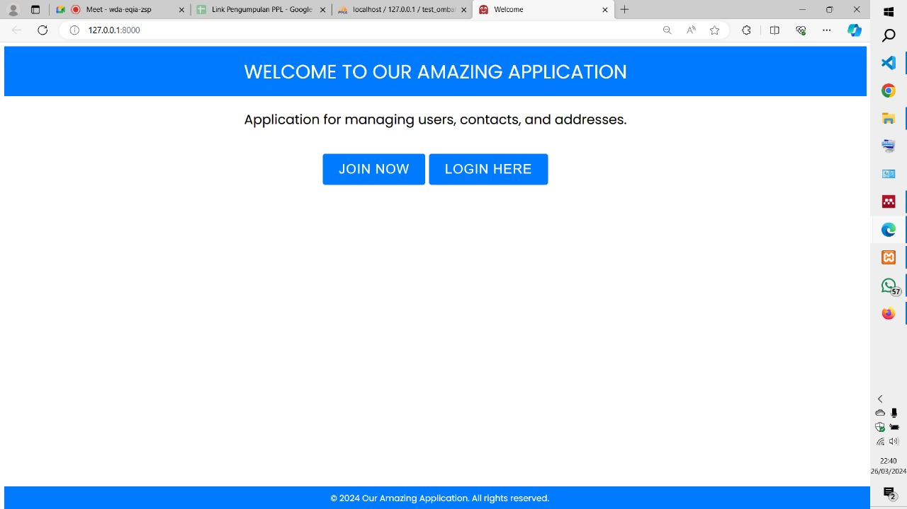
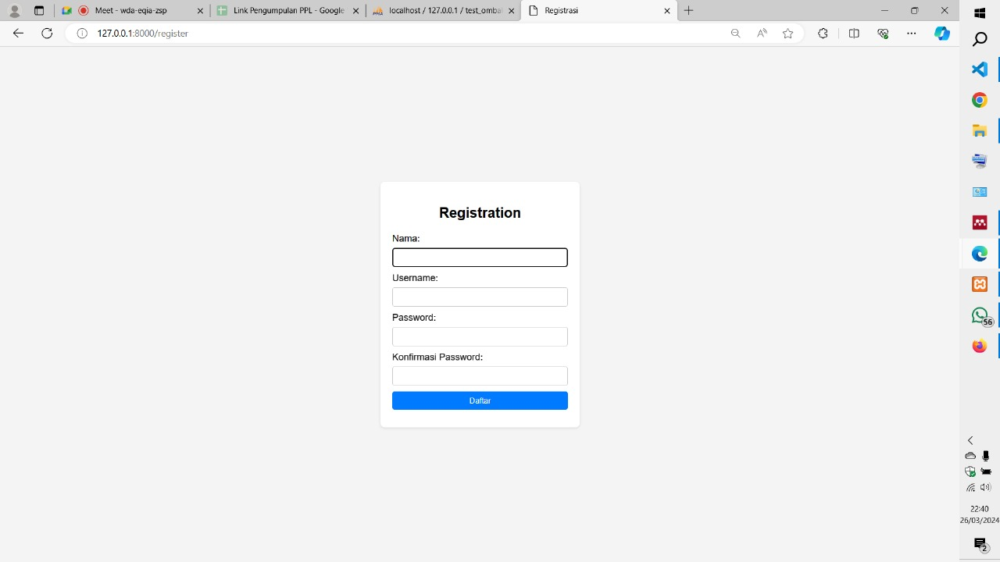
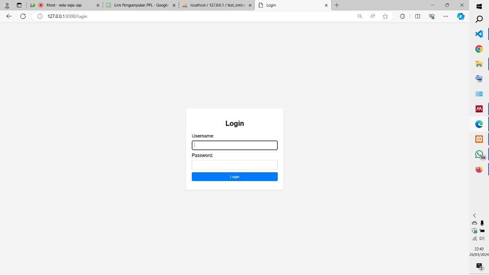
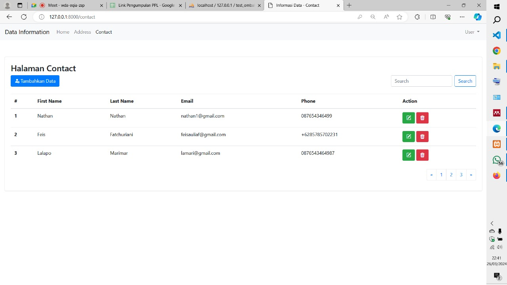
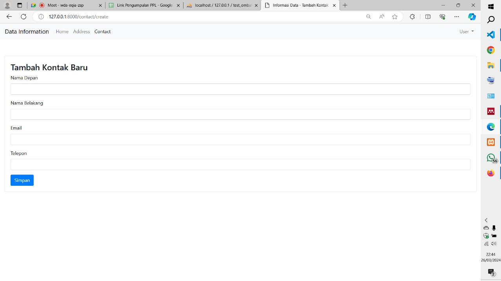
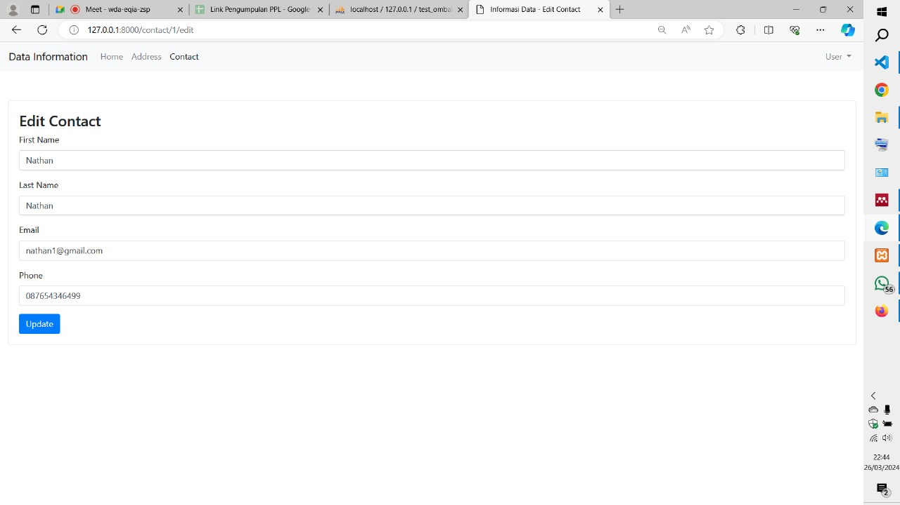
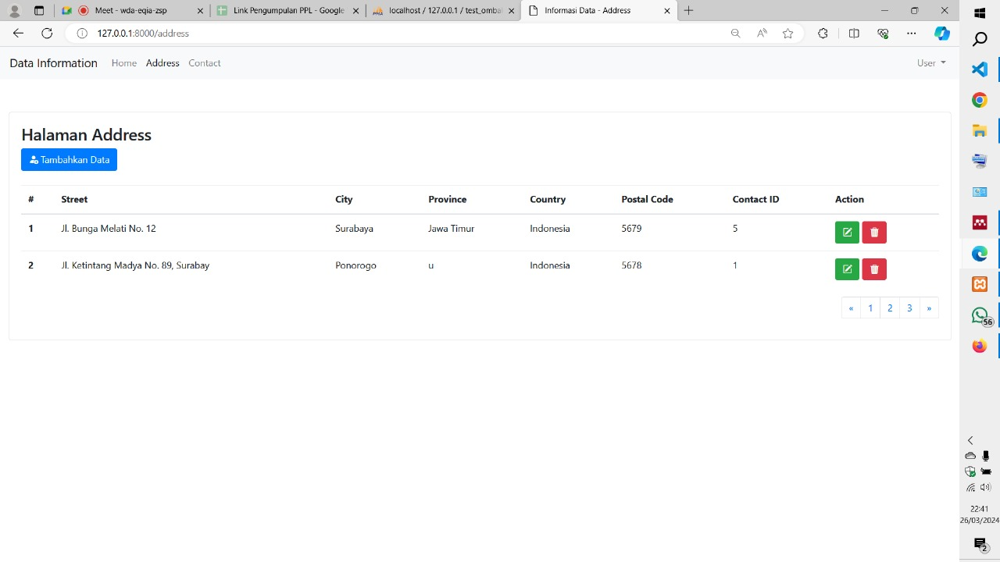
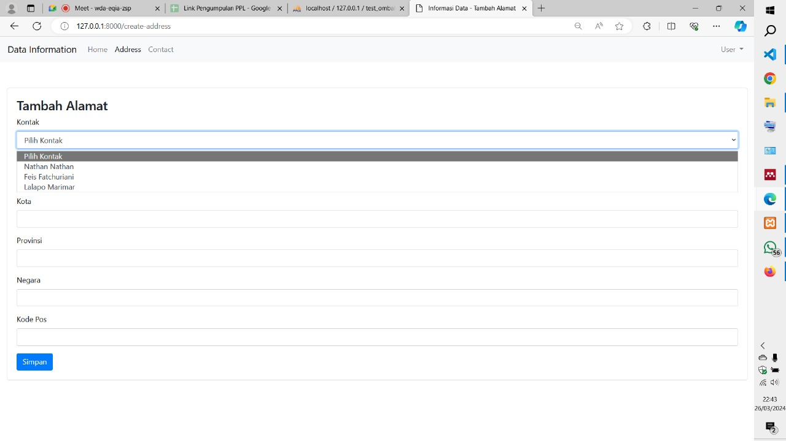
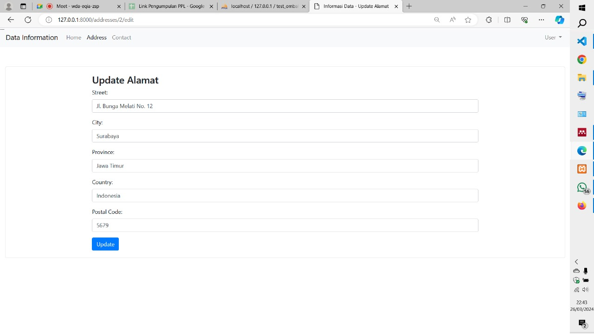

# CRUD User, Contact, Address Laravel | Ujian Tengah Semester

 
 

> Project ini adalah project praktikum untuk ujian tengah semester yang membuat CRUD dengan fitur user, contact, dan address. Tujuan dari project ini adalah untuk memperkuat pemahaman dalam pengembangan aplikasi web dengan menggunakan framework Laravel. Dengan project ini, belajar tentang bagaimana cara membuat operasi CRUD (Create, Read, Update, Delete) untuk entitas user, contact, dan address. Selain itu, Anda juga akan belajar tentang konsep autentikasi pengguna, validasi input, dan manajemen relasi antar entitas dalam sebuah aplikasi web. 

## Fitur-fitur
- User: Login, Register, Logout User, Edit User
- Contact: Create Contact, Update Contact, Delete Contact, Search Contact
- Address: Create Address, Update Address, Delete Address

## Tampilan
- Tampilan Awal
  
- Register
  
- Login
  
- Contact
  
- Create Contact
  
- Update Contact
  
- Address
  
- Create Address
  
- Update Address
  
  
  
  
